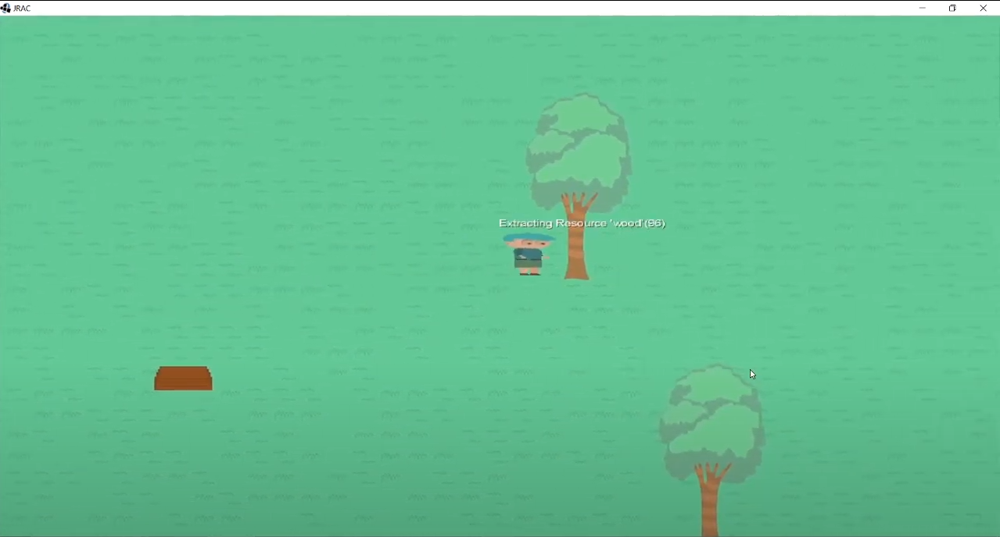

# About the Project

JRAC is a game that I started developing with Java. It was inspired by Minecraft, and it's all about exploring nature resources and building things. The more 'complex' idea behind, that I haven't got the time to implement yet, is to make the hero responsible for taking care of his world while exploring it (e,g. replanting trees).
